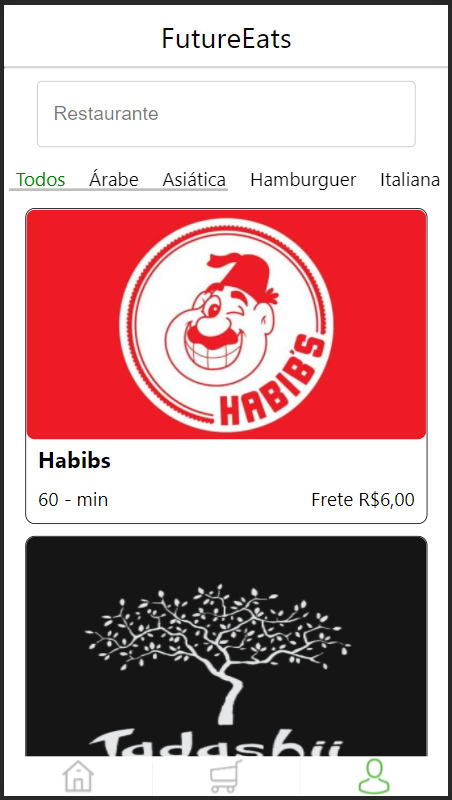
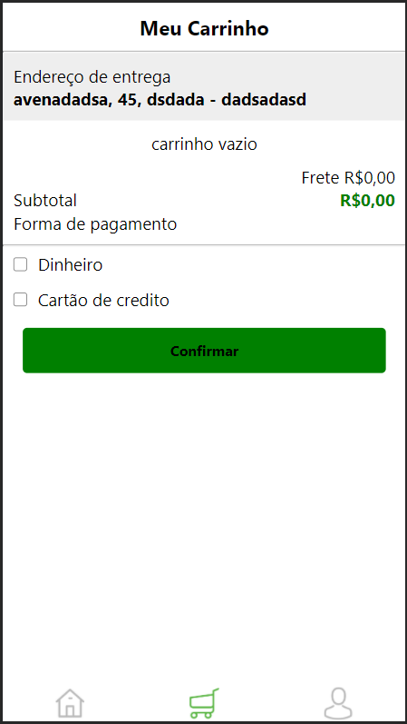
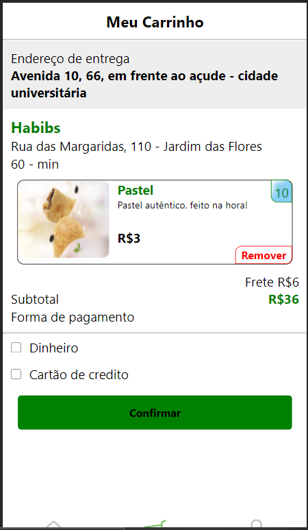
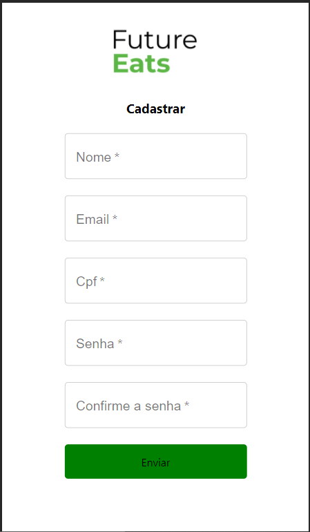
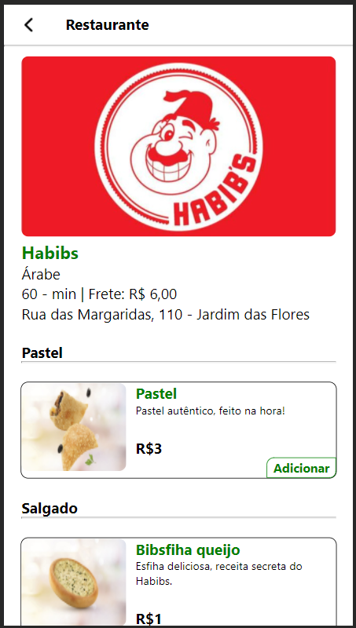

# tang-futureEatsA
This project is a personal project with React framework. The website was made using React router, styled components and Context, i love every second work in this project if you have something to add feel free to open a request.

# How to use it
1 - you need to have NodeJs 10.16 our higher and npm.
 
2 - npx create-react-app my-app to create the application.
 
cd my-app to enter in the directory.
 
npm start to start the application.
 
3 - start to code in app.js.
 
Any help you need to start coding javaScript in React React documentation
 
http://voiceless-smoke.surge.sh/
 

